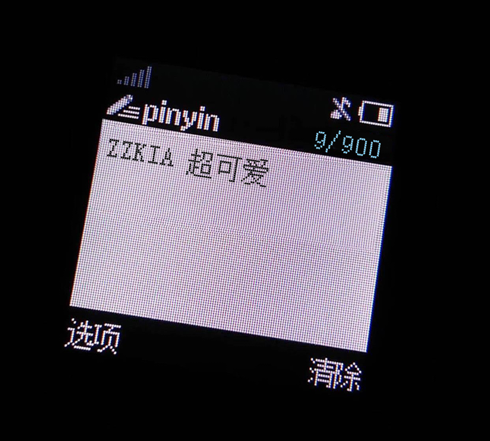

# ZZKIA

Generate the old Nokia message screenshot.

## Development

WEB CONTAINER IS RUNNING ON THE **5003** PORT.

Dev Mode(Server and web client will be hot-reload):

```
$ docker-compose up
```

Prod Mode:

```
$ docker-compose -f docker-compose.prod.yaml up -d
```

Demo picture: 
